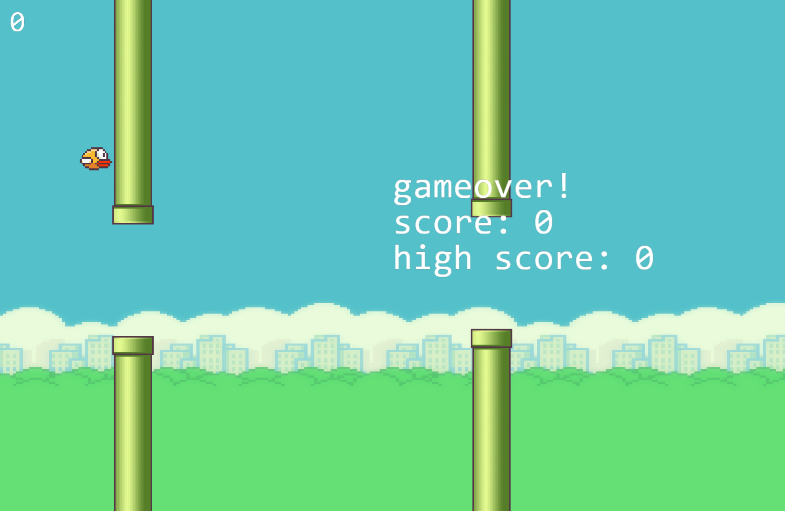

# Flappy bird Game using Kaboom Js

<div>First Clone the Repo using below code</div>

```bash
git clone <code repo link>
```

<div>Install dependencies<div>

```bash
npm install
```

<div>Run it</div>

```bash
npm run dev
```

## Preview


